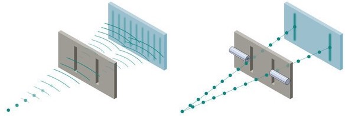
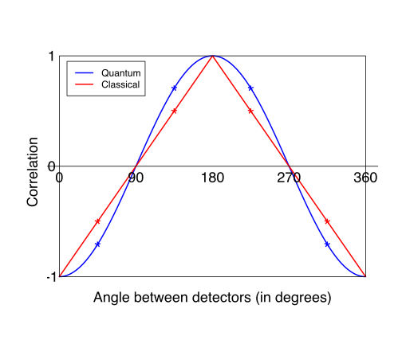

# Detecting Bombs with Quantum Mechanics

<section>
  

    

      &#x1f4a3;
    

    

      &#x1f4a3;
    

    

      &#x1f4a3;
    

    

      &#x1f4a3;
    

    

      &#x1f4a3;
    

  

</section>

## Superposition Crashcourse

A quantum mechanical system consists of a number of discrete states

The *wave function* `$\psi$` gives a description of these states

To find out which definite state it is in, we have to do a
*measurement*

A measurement is done by perturbing the system, for example by
making a single photon interact with it

In a simple quantum system where there are only two possible states,
`$|0\rangle$` and `$|1\rangle$`, the wave function can *collapse*
into either, but only one at a time
`$$
|\psi\rangle \rightarrow
\begin{cases}
|0\rangle\\ \\
|1\rangle\end{cases}
$$`

An example is a particle that can exhibit one of two properties:
spin up, or spin down

  

    $\uparrow$
  

  

    $\downarrow$
  

The innerproduct between two wave functions
`$$\langle\phi|\psi\rangle$$`
measures the overlap between the corresponding physical states

The states are orthogonal
`$$
\langle 0|0\rangle = 1\\
\langle 1|1\rangle = 1\\
\langle 0|1\rangle = 0\\
\langle 1|0\rangle = 0
$$`

The states are basis vectors, spanning
a *Hilbert space*

As vectors, they can be represented with the standard basis in 2D
`$$
\psi \rightarrow
\begin{cases}
\vec{e_0} = (1,0)\\ \\
\vec{e_1} = (0,1)
\end{cases}
$$`

Wave functions are super positions of states
`$$
|\psi\rangle = c_0|0\rangle + c_1|1\rangle\\\
$$`
where $c_0$ and $c_1$ are complex numbers.

The probability of finding the system in state $|0\rangle$ is $|c_0|^2$,
and $|c_1|^2$ for $|1\rangle$.

This is due to
`$$
\langle\psi|\psi\rangle = |c_0|^2 + |c_1|^2 = 1
$$`

Assuming there is a 50 % probability of either state
`$$
|\psi\rangle = \frac{1}{\sqrt{2}}\left(|0\rangle + |1\rangle\right)\\
$$`

## The Double-slit Experiment

A manifestation of the (quantum) superposition principle

<section>
  <h2>An Interaction-free Measurement</h2>
</section>
<section>
  A measurement that does not require any mechanical interaction
  to yield information about a state
</section>
<section data-auto-animate>
  

    

    

  

  

    

    

    

    

  

</section>
<section data-auto-animate>
  

    

    

  

  

    

      

      

    

    

    

  

</section>
<section data-auto-animate>
  

    

    

  

  

    

      

      

    

    

    

  

</section>
<section data-auto-animate>
  

    

      $\uparrow$
    

    

      $\downarrow$
    

  

</section>
<section data-auto-animate>
  

    

      ?
    

    

      ?
    

  

</section>
<section data-auto-animate>
  

    

      

        $\uparrow$
      

    

    

      

        $\downarrow$
      

    

  

</section>
<section data-auto-animate>
  Einstein, Podolsky and Rosen (1935): <q>Spukhafte Fernwirkung</q>
</section>
<section data-auto-animate>
  John Bell (1964): 
  <q>Hold on, EPR. What if we do measurements along different axes?</q>
</section>
<section data-auto-animate>
  

  
</section>

<section>
  <h2>The Elitzur&ndash;Vaidman Bomb Tester</h2>
</section>
<section data-auto-animate data-transition="zoom">
  

    

    

    

    

    

    

    

    

    

      

      

      

      

      

      

      

      

    

    

      

        A
      

      

        B
      

    

    

      

      

    

    

      

        &#x1f4a3;
      

      <audio data-preload data-autoplay>
        <source data-src="snd/bomb.mp3" data-preload></source>
      </audio>
    

  

</section>
<section>
  The photon starts in the state $|0\rangle$,
  which means it is on a horizontal path. 
  Conversely, being in state $|1\rangle$ means it is on
  a vertical path.
</section>
<section>
  Changing direction (reflecting off a mirror)
  $$
    |0\rangle \rightarrow i|1\rangle
  $$
  $$
    |1\rangle \rightarrow i|0\rangle
  $$
</section>
<section>
  Going into a beam splitter 
  $$
    |0\rangle \rightarrow 
    \frac{1}{\sqrt{2}}\left(|0\rangle + i|1\rangle\right)
  $$
  $$
    |1\rangle \rightarrow 
    \frac{1}{\sqrt{2}}\left(|1\rangle + i|0\rangle\right)
  $$
</section>
<section>
  Lower path blocked
  $$
    |0\rangle \rightarrow 
    i|1\rangle \rightarrow 
    -|0\rangle \rightarrow
    -\frac{1}{\sqrt{2}}\left(|0\rangle + i|1\rangle\right)
  $$
</section>
<section>
  Both paths open
  $$
    |0\rangle \rightarrow 
    \frac{1}{\sqrt{2}}\left(|0\rangle + i|1\rangle\right) \rightarrow
    \frac{1}{\sqrt{2}}\left(-|0\rangle + i|1\rangle\right) \rightarrow
    -|0\rangle
  $$  
</section>
<section>
  Let us consider this when there is a 50 % chance that a bomb
  is blocking the lower path
</section>
<section>
  <ol>
    <li class="fragment fade-in-then-semi-out">
      There is no photon registered in any of the two detectors.
      The bomb exploded and destroyed the photon in the process.
    </li>
    <li class="fragment fade-in-then-semi-out">
      The photon is registered by detector A.
      The result is inconclusive. 
      Whether the object is there or not there is always a chance for
      the photon to be detected by A. The experiment has to be repeated.
    </li>
    <li class="fragment fade-in-then-semi-out">
      The photon is registered by detector B.
      We conclude that the object is present, 
      since the probability of detecting the photon by
      B with both paths open is 0.
    </li>
  </ol>
</section>
<section>
  The experiment gives us a 25 % chance of finding out if the bomb is
  live without detonating it
</section>
<section>
  If we repeat the experiment for the bombs that were undecided, we
  can increase the detection to 33 %
</section>
<section>
  Improving the experimental setup can give a detection of arbitrary
  good precision
</section>
<section data-background-color="black">
</section>
